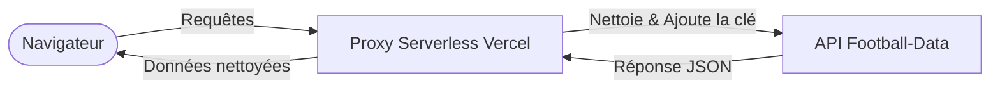

<!-- markdownlint-disable MD033 -->
<p align="center">
  
</p>

<p align="center">
  
  
  
</p>

<p align="center">
  
  
  
  
  
  
</p>
<!-- markdownlint-enable MD033 -->


Bienvenue dans le **manuel chronologique complet** du projet Ligue 1 Dashboard. Ce projet n'est pas un simple tableau de bord : c'est une démonstration concrète de la philosophie de **Développement Assisté par IA (AI-Assisted Coding)**. Il montre comment un développeur IA (Antigravity) orchestre tout le cycle de vie d'un produit technologique : du cadrage stratégique et de l'audit d'interface au développement fullstack et au déploiement industriel.

---

> [!IMPORTANT]
> **Définition du périmètre du MVP (Minimum Viable Product)** : 
> - Expérience sur une page unique (sans sous-pages).
> - KPIs à haute densité pour une lecture instantanée.
> - Classement dynamique (Standings Table) connecté en temps réel à l'API.
> - 4 visualisations statistiques clés (graphiques en barres & histogrammes).
> - **Aucune** navigation complexe afin de maintenir la rapidité et la concentration.

Tous les prompts, la stratégie et la documentation sont disponibles dans le dossier [**docs**](/docs).


### Le Résultat Final
La mission : Transformer une vision stratégique en un tableau de bord Ligue 1 fonctionnel de qualité industrielle.

<div align="center">
  
</div>

---

## I. Cadrage Stratégique

Chaque projet commence par une **intention** claire. Nous avons refusé le « Feature Creep » (l'ajout superflu de fonctionnalités) et défini un périmètre de MVP strict pour garantir une livraison haut de gamme dans un temps record en nous appuyant sur notre [Brief Stratégique](docs/I.%20Strategic%20Framing/Strategy%20and%20Concept.md).

### Étape 1.1 : Stratégie & Vision
Toutes les recherches stratégiques ont été synthétisées dans un document de cadrage visuel permettant à l'équipe de s'aligner sur la vision du produit final avant d'écrire la moindre ligne de code — une synthèse en une page résumant le périmètre, les indicateurs clés (KPIs) et la vision produit.

> **Extrait du [Document de Stratégie](docs/I.%20Strategic%20Framing/Strategy%20and%20Concept.md) :**
> *Objectif : Développer un tableau de bord prêt pour la production pour la Ligue 1 française.*
> *Contexte : Utiliser une visualisation de données à haute densité pour fournir des informations immédiates sur les KPIs.*

> **Prompt Stratégique (Entrée IA) :**
> *"Act as a Senior Data Engineer. Analyze the Ligue 1 API limits (10 req/min) and design a high-density dashboard that avoids 'Feature Creep'. Prioritize standings and statistical bar charts. The aesthetic must be 'FootX-Dark'—ultra-professional and data-dense."*

> **Décision centrale de l'IA (Orchestration) :**
> *"J'ai associé le MVP à 4 points d'accès (endpoints) spécifiques. Pour respecter l'offre gratuite (Free Tier), je vais implémenter un proxy côté serveur sur Vercel afin de gérer le jeton `X-Auth-Token` en toute sécurité. Les visualisations seront limitées à 4 graphiques à fort impact pour maintenir la concentration sur une seule page. Stratégie verrouillée."*

---

## II. Audit Visuel : Le Référentiel FootX

Pour éviter un rendu « générique » ou vide, nous avons audité **FootX.fr**, une référence incontournable dans la visualisation de données sportives professionnelles. Nous avons capturé 5 vues clés pour enseigner à notre IA l'« ADN des données » spécifique du football français.

### Étape 2.1 : Analyse de la hiérarchie de la page d'accueil
L'audit de la page d'accueil nous aide à comprendre comment accueillir l'utilisateur avec des informations immédiates à forte valeur ajoutée ; la capture d'écran montre la page d'accueil de FootX — la hiérarchie et le positionnement des principaux indicateurs de performance (KPIs) et de la navigation.
<div align="center">
  
</div>

<br />

| [**Tableaux de Données Denses (2.2)**](docs/II.%20Graphic%20Collections/references/screenshots_footx/footx_ranking.png) | [**Résultats & Performance (2.3)**](docs/II.%20Graphic%20Collections/references/screenshots_footx/footx_results.png) |
|---|---|
|  |  |
| [**Rythme des Matchs (2.4)**](docs/II.%20Graphic%20Collections/references/screenshots_footx/footx_upcoming.png) | [**Analyses Détaillées (2.5)**](docs/II.%20Graphic%20Collections/references/screenshots_footx/footx_data.png) |
|  |  |

### Ingénierie du Prompt d'Interface (UI)
Nous ne nous sommes pas contentés de dire à l'IA de « faire un design sombre ». Nous avons rédigé un prompt d'audit exhaustif pour en extraire des jetons de design spécifiques.

> **Extrait de prompt_design.md :**
> *"You are a Senior UI/UX Designer. Audit the provided screenshots of FootX.fr. Extract the following: Primary Background HEX, Surface Card HEX, Border Radius scaled in PX, and Font Stack hierarchy. Output a JSON design system."*

> [!TIP]
> **Restauration du Méga-Prompt** : Le prompt complet de l'audit de design est enregistré dans [prompt_design.md](docs/II.%20Graphic%20Collections/prompt_design.md). Il demande à l'IA d'échantillonner directement les codes HEX, les rayons de bordure (border-radius) et les échelles d'espacement à partir des images de référence.

### Étape 2.6 : L'analyse de design par l'IA
L'IA traite les images de référence et produit un ensemble structuré de règles de design — prompt et résultats (couleurs, arrondis, typographie) dérivés des benchmarks FootX (capture d'écran ci-dessous).
<div align="center">
  
</div>

### Le Système de Design Final
Le résultat est répertorié dans [theme.md](docs/II.%20Graphic%20Collections/theme.md), qui fait office de constitution visuelle du projet.

> **Extrait de [theme.md](docs/II.%20Graphic%20Collections/theme.md) :**
> *--accent-primary: #DAF42D; /* Neon Lime / Yellow */*
> *--dark-bg: #121212;*
> *Font: 'Outfit', sans-serif;*
> *Border-radius: 12px;*

---

## III. Infrastructure des Données & Validation de l'API

Le tableau de bord fonctionne avec de vraies données de production via l'API **football-data.org (v4)**.

> **Extrait d'[architecture.md](docs/III.%20Architecture%20%26%20API/architecture.md) :**
> *Correspondance entre les composants de l'interface (UI) et les collections de l'API :*
> *- Tableau des classements -> /v4/competitions/FL1/standings*
> *- Historique des matchs -> /v4/competitions/FL1/matches*
> *- Métadonnées des équipes -> /v4/competitions/FL1/teams*

### Configuration de l'API étape par étape

### Étape 3.1 : Découverte du fournisseur
Nous avons commencé par explorer le site officiel du fournisseur pour comprendre la disponibilité des données pour la Ligue 1 (charte graphique de football-data.org — source officielle pour l'API, voir ci-dessous).
<div align="center">
  
</div>

### Étape 3.2 : Accès au portail de l'API
Navigation vers le portail des développeurs pour consulter le guide de démarrage rapide et les exigences d'intégration — page d'accueil du portail de l'API (capture d'écran ci-dessous).
<div align="center">
  
</div>

### Étape 3.3 : Inscription
Création d'un compte de développeur pour obtenir un jeton `X-Auth-Token` unique (formulaire d'inscription ci-dessous).
<div align="center">
  
</div>

### Étape 3.4 : Analyse de l'offre et des quotas
Audit des limites de l'offre gratuite (« Free Tier ») : la limite de 10 appels/minute nécessite une stratégie de cache intelligente (capture d'écran des tarifs et quotas ci-dessous).
<div align="center">
  
</div>

### Étape 3.5 : Accès au profil développeur
Validation de l'e-mail et accès au tableau de bord personnel pour la gestion de la clé (profil développeur — validation d'e-mail et accès à la clé, voir ci-dessous).
<div align="center">
  
</div>

### Étape 3.6 : Sécurisation de la clé d'API
L'étape finale de la configuration consiste à récupérer la clé d'API (`API_KEY`) qui sera utilisée par notre proxy sécurisé — copiez le jeton et enregistrez-le dans les variables d'environnement Vercel (ne le mettez jamais dans le code côté client ; capture d'écran ci-dessous).
<div align="center">
  
</div>

### Étape 3.7 : Connexion au portail développeur
Une fois inscrit, vous vous connectez pour accéder à la documentation et à votre clé d'API à partir de cette interface (écran de connexion ci-dessous).
<div align="center">
  
</div>

### Étape 3.8 : Consultation de la documentation de l'API
Le fournisseur propose une référence claire pour l'ensemble des points d'accès (endpoints), paramètres et structures de réponses — indispensable avant d'écrire le moindre code d'intégration (capture d'écran de la documentation de l'API ci-dessous).
<div align="center">
  
</div>

---

## IV. Suite de Validation Postman

Avant d'écrire la moindre ligne de code, nous avons validé chaque structure JSON. Cette stratégie « Postman First » garantit que nos modèles de données sont exacts à 100 %.

### Validation étape par étape

### Étape 4.1 : Localisation de la collection officielle
Nous avons trouvé la collection Postman officielle fournie par l'équipe de l'API pour accélérer nos phases de test (lien d'importation depuis la documentation de l'API ; capture d'écran ci-dessous).
<div align="center">
  
</div>

### Étape 4.2 : Importation de l'environnement
Nous avons importé la collection dans notre espace de travail Postman local pour commencer la configuration (étape d'importation — prêt à définir les variables et à exécuter les requêtes ; voir ci-dessous).
<div align="center">
  
</div>

### Étape 4.3 : Configuration des variables
Définition de l'URL de base et des en-têtes d'authentification pour permettre des tests automatisés sur tous les points d'accès (URL de base et X-Auth-Token ; capture d'écran ci-dessous).
<div align="center">
  
</div>

### Étape 4.4 : Test des métadonnées de la compétition
Vérification de la récupération correcte du nom de la Ligue 1, de la saison et de la journée de championnat en cours (réponse de la requête GET ci-dessous).
<div align="center">
  
</div>

### Étape 4.5 : Validation des classements & statistiques
Vérification que le point d'accès pour le tableau (« Table ») renvoie bien les positions, points et différences de buts pour les 18 équipes (requête GET standings — classement complet ci-dessous).
<div align="center">
  
</div>

### Étape 4.6 : Audit des ressources graphiques
Confirmation que les emblèmes des équipes (logos) sont fournis sous forme d'URLs valides que notre frontend peut afficher (requête GET teams — liste des effectifs et URLs des logos ; capture d'écran ci-dessous).
<div align="center">
  
</div>

**Étape 4.7 : Exportation d'échantillons JSON de production**
Nous avons enregistré les réponses réelles dans des fichiers JSON locaux pour concevoir un mock statique et permettre un développement hors ligne.

```json
/* Échantillon issu de [standings_FL1.json](docs/III.%20Architecture%20%26%20API/postman/samples/standings_FL1.json) */
{
  "competition": { "name": "Ligue 1", "code": "FL1" },
  "season": { "startDate": "2025-08-17", "currentMatchday": 22 },
  "standings": [
    {
      "type": "TOTAL",
      "table": [
        { "position": 1, "team": { "name": "Paris Saint-Germain FC" }, "points": 54 },
        { "position": 2, "team": { "name": "Olympique de Marseille" }, "points": 48 }
      ]
    }
  ]
}
```

Découvrez tous les échantillons exportés ici : [postman/samples/](docs/III.%20Architecture%20%26%20API/postman/samples/)

---

## V. Architecture & Ingénierie de Contexte

Nous avons mis en place une structure de projet transparente pour l'IA (« AI-Transparent »), offrant une clarté totale à l'agent de développement tout en conservant un modèle client-proxy découplé pour des raisons de sécurité.

### Étape V.1 : Échafaudage des prompts (Scaffolding)
Nous avons fourni à l'IA deux importantes injections de logique pour définir les règles d'architecture et de manipulation des données.

> **Extrait de [architecture.md](docs/III.%20Architecture%20%26%20API/architecture.md) :**
> *"You are a Senior Data Architect. Map the /v4/competitions/FL1/matches endpoint to the MatchCard component. Ensure the 'status' field is parsed to show 'Live' for IN_PLAY matches."*

> [!TIP]
> **Périmètre de la logique des données** : L'ensemble de la logique de traitement des données est décrit dans [technical_spec.md](docs/IV.%20Context%20Engineering/Contexte/MarkDowns/technical_spec.md).

> **Extrait de [technical_spec.md](docs/IV.%20Context%20Engineering/Contexte/MarkDowns/technical_spec.md) :**
> *"The SPA must handle 10 API calls per minute. Implement an aggressive LocalStorage cache on the /standings endpoint with a 300s TTL."*

<div align="center">
  
</div>

---

### Étape V.2 : Architecture technique
Le résultat est un flux de requêtes sécurisé qui nettoie les jetons et oriente les requêtes vers l'API.



Cette architecture se traduit par une organisation de fichiers propre et modulaire :

```text
dashboard/
├── api/             # Proxy sécurisé Vercel (Node.js)
├── docs/            # Base de connaissances principale (Knowledge Base)
├── public/          # Interface utilisateur (UI) de production
│   ├── app.js       # Moteur d'alimentation des données (Data Hydration)
│   ├── index.html   # Structure sémantique HTML
│   └── style.css    # Système de style CSS Sport-Tech
└── server.js        # Serveur Node local pour le développement
```

---

### Étape V.3 : Schéma de correspondance Données-UI
Nous avons cartographié chaque bloc d'interface avec sa collection d'API respective, comme défini dans notre document [architecture.md](docs/III.%20Architecture%20%26%20API/architecture.md) — le plan directeur de la session de développement.

<div align="center">
  
</div>

---

## VI. Implémentation & Vibecoding

La phase VI correspond au moment où le tableau de bord est **construit et exécuté** lors d'une session de **vibecoding** avec **Antigravity** (notre agent de codage IA).

---

### 6.1 Session de Vibecoding (étape par étape avec Antigravity)

La séquence suivante présente le flux de travail d'**Antigravity**. Chaque étape représente une action distincte du cycle de développement orchestré par l'IA.

### Étape 6.1.1 : Initialisation stratégique
Création du squelette du projet et choix du modèle de base pour le tableau de bord Ligue 1.
<div align="center">
  
</div>

### Étape 6.1.2 : Injection du contexte
Chargement des documents de stratégie, d'architecture et de design pour que l'agent comprenne le « contrat » technique.
<div align="center">
  
</div>

### Étape 6.1.3 : Formulation du prompt en langage naturel
Pilotage de l'agent avec un prompt concret pour implémenter le proxy et alimenter le moteur de données.
<div align="center">
  
</div>

### Étape 6.1.4 : Génération de code autonome
L'agent finalise la génération des trois fichiers clés (le proxy, la logique applicative et le style CSS).
<div align="center">
  
</div>

#### **Fichier de Code A : Proxy d'API Sécurisé ([api/proxy.js](api/proxy.js))**  
La clé secrète `API_KEY` est stockée dans les variables d'environnement ; un environnement d'exécution Node.js relaie les requêtes et évite les erreurs de partage de ressources CORS.
```javascript
export default async function handler(req, res) {
    const { endpoint } = req.query;
    const API_KEY = process.env.API_KEY;
    const response = await fetch(`https://api.football-data.org/v4${endpoint}`, {
        headers: { 'X-Auth-Token': API_KEY }
    });
    const data = await response.json();
    res.status(200).json(data);
}
```

#### **Fichier de Code B : Moteur de Données ([public/app.js](public/app.js))**  
Un point d'entrée unique récupère le classement et les matchs au chargement, puis alimente les KPIs et les graphiques du tableau de bord.
```javascript
async function loadDashboard() {
    const standingsData = await apiFetch('/competitions/FL1/standings');
    const matchesData = await apiFetch('/competitions/FL1/matches?season=2025');
    renderKPIs(standingsData, matchesData);
    renderTable(standingsData);
    renderCharts(standingsData, matchesData);
}
```

#### **Fichier de Code C : Jetons de Design ([public/style.css](public/style.css))**  
Appliqués via des propriétés personnalisées CSS pour garantir la conformité des couleurs et des espacements avec l'audit de l'interface.
```css
:root {
  --bg-color: #121212;
  --panel-bg: #1A1A1A;
  --accent-color: #DAF42D; /* Neon Lime */
}
.standings-table {
  width: 100%;
  background: var(--panel-bg);
  border-collapse: collapse;
}
```

### Étape 6.1.5 : Débogage & Résolution
Gestion de la configuration de la connexion locale (Localhost) pour s'assurer que le serveur est prêt à recevoir le trafic.
<div align="center">
  
</div>

### Étape 6.1.6 : Lancement du serveur local
Exécution du backend Node.js pour démarrer l'environnement de développement.
<div align="center">
  
</div>

### Étape 6.1.7 : Synchronisation du navigateur
Actualisation de la fenêtre de prévisualisation pour synchroniser la logique nouvellement écrite avec l'environnement d'exécution du navigateur.
<div align="center">
  
</div>

### Étape 6.1.8 : Version finale validée
Le tableau de bord tourne désormais en local avec de vraies données, entièrement configuré et stylisé selon le cahier des charges.
<div align="center">
  
</div>

---

## VII. Livraison Finale & Déploiement

La transition d'un environnement de développement local vers une application en production est la dernière étape majeure de ce cycle de vie orchestré par l'IA.

### 7.1 Prérequis logiciels

Pour synchroniser votre code avec GitHub et le déployer, vous devez installer Git sur votre machine.

### Étape 7.1.1 : Prérequis logiciel (Téléchargement de Git)
Téléchargement du programme d'installation depuis le site officiel (page de téléchargement ci-dessous).
<div align="center">
  
</div>

### Étape 7.1.2 : Prérequis logiciel (Installation de Git)
Suivez les étapes de l'assistant d'installation pour configurer Git sur votre système (assistant d'installation ci-dessous).
<div align="center">
  
</div>

### 7.2 GitHub : Contrôle de Version & Synchronisation Distante

Chaque étape importante est versionnée et envoyée vers le dépôt distant, garant de la source de vérité.

**Commandes (premier envoi depuis le local) :**

```bash
git init
git remote add origin git@github.com:USERNAME/dashboard.git
git add .
git commit -m 'my first commit'
git push -u origin main
```

### Étape 7.2.1 : Création du dépôt
Configuration de la destination — initialisation d'un nouveau dépôt pour héberger le projet.
<div align="center">
  
</div>

### Étape 7.2.2 : État de la première synchronisation
Le dépôt est vide et prêt à recevoir le premier commit des fichiers du tableau de bord.
<div align="center">
  
</div>

### Étape 7.2.3 : Validation du code distant
Confirmation que tous les dossiers (api, docs, public) sont correctement synchronisés sur le serveur.
<div align="center">
  
</div>

### Étape 7.2.4 : Alignement des états
Assurer que l'état local et l'état distant sont parfaitement synchronisés pour préparer le déploiement.
<div align="center">
  
</div>

---

### 7.3 Vercel : Déploiement en Production

Transformation du dépôt en une application web fonctionnelle de qualité industrielle.

### Étape 7.3.1 : Importation du projet
Connexion du dépôt GitHub à la plateforme Vercel pour lancer le processus de compilation (build) dans le cloud.
<div align="center">
  
</div>

### Étape 7.3.2 : Configuration de la compilation (Build Settings)
Définition de l'environnement de développement et de la structure des dossiers pour le déploiement serverless.
<div align="center">
  
</div>

### Étape 7.3.3 : Premier suivi de déploiement
Déclenchement du premier cycle de build — observation du résultat initial avant la configuration de l'environnement.
<div align="center">
  
</div>

### Étape 7.3.4 : Configuration des variables d'environnement
Accès aux paramètres du projet pour injecter les identifiants requis pour la production.
<div align="center">
  
</div>

### Étape 7.3.5 : Injection sécurisée du jeton d'API
Ajout de la variable `X-Auth-Token` sous forme de variable d'environnement chiffrée pour la production.
<div align="center">
  
</div>

### Étape 7.3.6 : Lancement industriel
L'application est maintenant en ligne et totalement opérationnelle sur son URL de production.
<div align="center">
  
</div>

---

## 🏆 Mission Accomplie !

Félicitations ! Votre **Tableau de Bord Ligue 1** est entièrement opérationnel et prêt pour la production.

**Démo en ligne** : [https://dashboard-one-wheat-33.vercel.app/](https://dashboard-one-wheat-33.vercel.app/)

*Ce guide complet illustre la puissance du développement orchestré par IA. De la stratégie à la mise en production, vous avez franchi avec succès toutes les étapes de ce flux de travail assisté.*

<div align="center">
  
</div>
